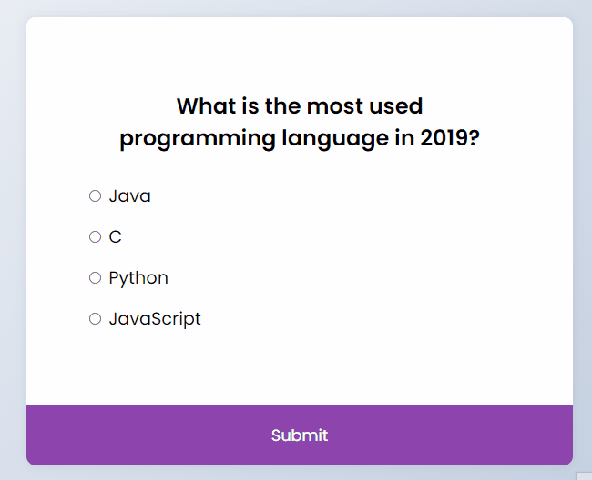
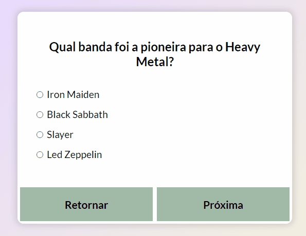

# Rock'n Roll Quizz 🤘

Test your knowledge about rock'n roll with this Quizz.

## 🚀 Technologies
- HTML
- CSS
- JavaScript

## ℹ Description/Important notes

It was inspired by a project made by Florin Pop. Here is his original project:
- https://github.com/florinpop17/10-projects-10-hours/tree/master/quiz-app

I did some basic modifications on HTML and CSS as you can compare here:
### Original by Florin Pop:

<h1>
  
</h1>

### Now, this is my Quizz:

<h1>
  
</h1>

Basically, there are two modifications:
- The color, that doesn't matter so much.
- The button to return to the previous questions, it's important here. With this application you can return to a previous question if you think some answer isn't right.
So, to return to a previous question and verify if the answer was right or wrong, and verify the score, was necessary a new logic. This is the biggest difference between mine and his project. You can see here:

```javascript
var counterAnswersCorrect = 0;

function hitCounter(){

  quizRockList.forEach((answerEl) => {

    var answersCorrect = answerEl.hit

    if(answersCorrect){
      counterAnswersCorrect ++;
    }

  })
  
  function returnQuestion(){

  if(currentQuiz > 0){
    currentQuiz --;
  }

  loadQuiz();
  }
}
```
It calculates how many questions were right at the end of quizz, it's just possible because in the list of objects (questions), there is the 'hit', a boolean that tells us if the answer was right or wrong.
```javascript
const quizRockList = [
  
  {
    question: 'Qual banda foi a pioneira para o Heavy Metal?',
      a: 'Iron Maiden',
      b: 'Black Sabbath',
      c: 'Slayer',
      d: 'Led Zeppelin',
      correct_answer: 'b',
      hit: false
  }, 
```
And here you can see how to verify if it was right or wrong:
```javascript
  if(answer != undefined){
    if(answer === quizRockList[currentQuiz].correct_answer){
      quizRockList[currentQuiz].hit = true;
    }else{
      quizRockList[currentQuiz].hit = false;
    }
```
Well, it's not all about the project, but I just want to bring here what I did differently to practice what I have been learning.

## 📝License
This project is under the MIT license. See the [LICENSE](https://choosealicense.com/licenses/mit/) for more information.

##

If you want to collaborate, to give some opinion, if you know a different way to do, or just want to make a new friend, than send me an e-mail or a message on my LinkedIn:
 <a href = "mailto:lucas.virolli2@gmail.com"></a>
 <a href="https://www.linkedin.com/in/lucasvirollidalbello/" target="_blank"></a> 

##

Made with much 💜 by Lucas Virolli 🙋‍♂️
